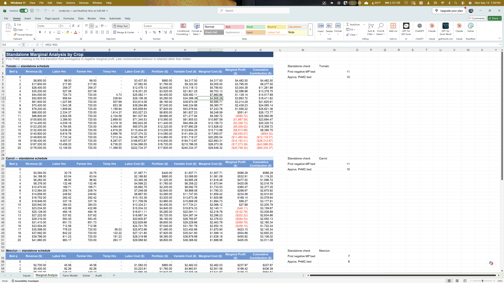

# Perfect Competition Stage 3 Analysis

The model showed that my hypothesis for a 9/11/29 allocation differed from the farm model. The model showed that the optimal allocation was 10 tomatoes, 20 carrots, and 30 mesclun. Furthermore, the model used 60 beds out of the 64 available beds. The model showed a season profit of $42,761.66, which matches the published check figure of approximately $42,762 when rounded to the nearest dollar. This confirms that the model reproduces the published profit result using the specified input precision.

The farm plan guides the farmer in allocating resources to maximize season profit and indicates when to stop adding beds once marginal cost exceeds marginal revenue.

Figure 1 shows the Solver's optimal crop allocation, season profit, and the status of the farm's constraints.

The farmer should stop growing additional tomatoes after 10 beds because marginal profit becomes negative as marginal cost exceeds marginal revenue. The marginal profit from growing the 10th bed is approximately $551. The marginal profit from growing the 11th bed is approximately -$591. In perfect competition, the farmer cannot control prices because the farmer is a price taker. The farmer should continue adding production while marginal revenue is greater than marginal cost. As shown in Figure 2, the marginal profit becomes negative with the 11th tomato bed when marginal cost exceeds marginal revenue.

## Figure 2. Tomato Standalone Marginal Analysis

The tomato marginal cost is reduced when growing the 6th bed due to increased utilization of temporary labor after the farmer has exhausted the 720-hour work limit. While the labor hours worked increase, temporary workers are paid at a lower wage, resulting in lower marginal cost for the 6th bed. This decrease in marginal cost can also be seen in Figure 2, where marginal cost falls from $7,660.43 for the 5th bed to $4,906.02 for the 6th bed.

The Solver stops growing carrots at 20 beds and mesclun at 30 beds due to binding constraints. The temporary worker constraint is slack as 3.16 of 4 workers were used. Furthermore, the tomato constraint is slack, but growing beyond 10 beds results in negative marginal profit.  Given shadow values of approximately $352.49 for carrots and $246.47 for mesclun, if these constraints were relaxed, allowing one additional carrot bed beyond 20 would increase profit by approximately $352.49. This is approximately $106.02 more than the marginal value of relaxing the mesclun constraint.

Although carrots and mesclun may generate standalone losses after fixed costs are considered, it can still make economic sense to grow them in the short run if price exceeds average variable cost (AVC). At 20 carrot beds, AVC is approximately $1,918.45 per bed compared with a price of $2,094. At 30 mesclun beds, AVC is approximately $2,430.74 per bed compared with a price of $2,700. Because price exceeds AVC for both crops, each covers its variable costs and contributes toward fixed costs. This shutdown decision is different from the marginal decision to add another bed, which depends on whether marginal revenue exceeds marginal cost.

My hypothesis of 9 tomatoes, 11 carrots, and 29 mesclun differed from the farm model because I was focused on the costs associated with expanding the crop beds. This made me hesitant about expanding production and resulted in a lower crop allocation, such as recommending 11 carrot beds rather than Solver's 20 beds. Using marginal analysis clarified the marginal revenue versus marginal cost relationship when growing additional crops. On the surface, the higher costs made me hesitant to expand production, but recognizing when marginal revenue is greater than marginal cost provides guidance that growing more could be profitable. Had I followed my hypothesis of growing only 11 carrot beds, I would have missed the opportunity to maximize profits.
